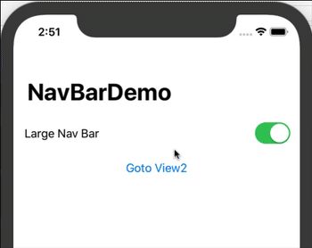

# Navigation Bar Title Size Demo
## Selecting the appropriate navbar size
**(Updated for Xcode 11 Beta 5)**

This demo shows how to select either large navigation bar (the default) or a small, inline bar.



``` swift
//
//  ContentView.swift
//  SwiftUI-NavBarDemo
//
//  Created by Russell Archer on 05/08/2019.
//  Copyright © 2019 Russell Archer. All rights reserved.
//
//  Updated for Xcode 11 Beta 5
//

import SwiftUI

struct ContentView: View {
    @State private var largeNavBar = true

    var body: some View {
        return NavigationView {
            VStack {
                Toggle(isOn: $largeNavBar) { Text("Large Nav Bar") }.padding()
                NavigationLink(destination: View2()) { Text("Goto View2") }
                Spacer()
            }

            .navigationBarTitle(Text("NavBarDemo"), displayMode: largeNavBar ? .large : .inline)  // Large nav bar title
        }
    }
}
```

